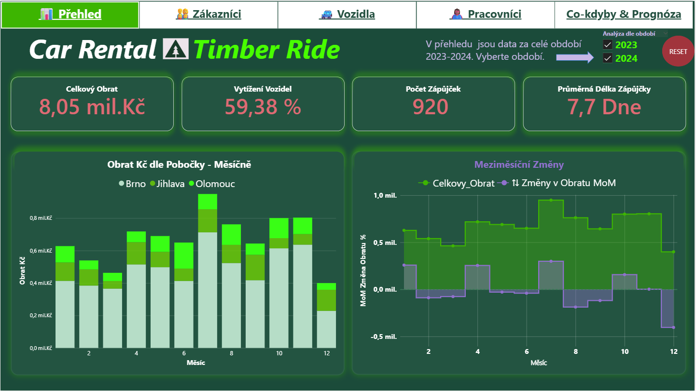
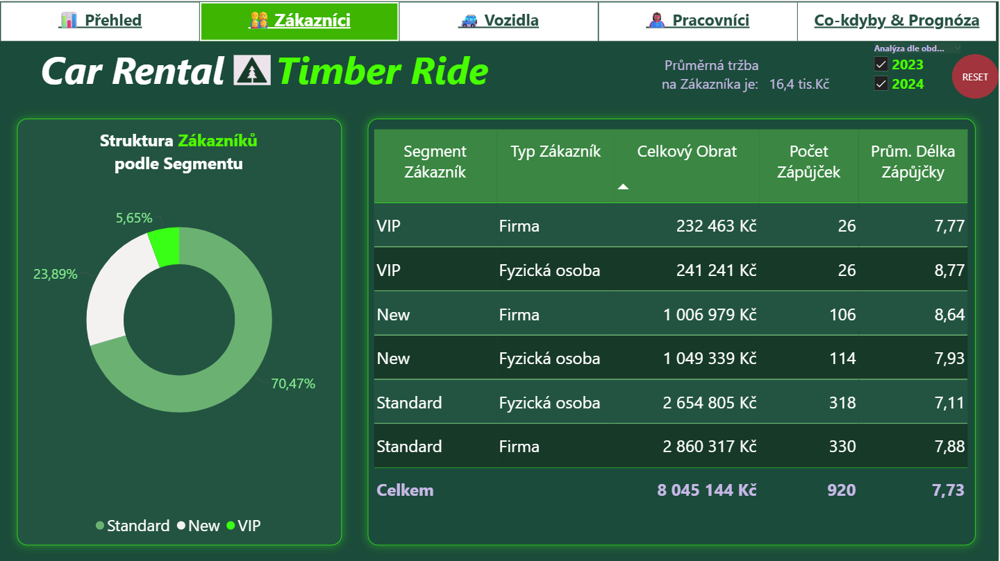
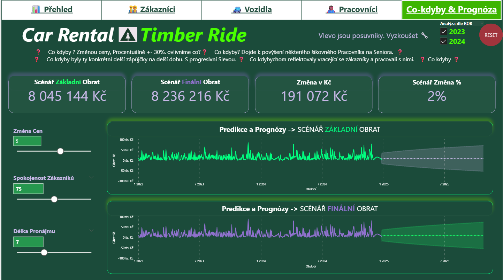
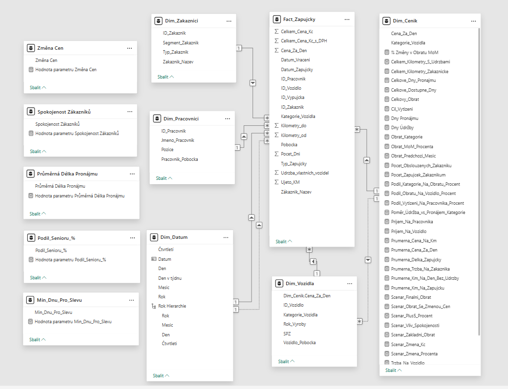
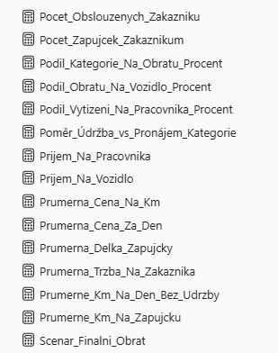

# 🚗 TimberRide AutoPůjčovna - Power BI Dashboard

<div align="center">


</div>

---

## 🎯 O Projektu

**TimberRide Dashboard** je interaktivní Power BI report vytvořený v rámci **ENGETO projektu**. Projekt analyzuje výkonnost imaginární autopůjčovny pomocí vlastního datasetu a pokročilých vizualizačních technik v různých obdobích.

> 🎓 *Tento projekt vznikl jako součást ENGETO kurzu: Datová analýza s Pythonem. Je dle požadavků ENGETO dle zadání a demonstruje pokročilé Power BI funkce včetně prognózování a What-If scénářů.*

---

## ✅ Splněné Požadavky ENGETO

### 📊 **5 Stránek Dashboardu**
- **📈 Přehled** - Executive KPI a trendy obratu
- **👥 Zákazníci** - Segmentace a analýza chování zákazníků
- **🚙 Vozidla** - Optimalizace vozového parku a využití
- **👷 Pracovníci** - HR analytics a produktivita zaměstnanců
- **🔮 Co-Kdyby & Prognóza** - Strategické simulace a predikce

### 🎨 **5+ Typů Vizualizací**
- **KPI karty** s růstovými indikátory
- **Sloupcové grafy** pro porovnání kategorií
- **Čárové grafy** s forecasting funkcí
- **Koláčové grafy** pro segmentaci
- **Tabulky** s podmíněným formátováním

### 🎛️ **Interaktivní Prvky**
- **Slicery** pro filtrování období (2023-2024)
- **Navigace** mezi stránkami pomocí záložek
- **What-If parametry** - změna cen, spokojenost zákazníků, délka pronájmu
- **Cross-filtering** mezi všemi vizuály

### 🗄️ **Datový Model**
- **Star Schema** s propojením 5 tabulek
- **Hierarchie**: Datum (Rok → Měsíc → Den)
- **25+ DAX Measures** pro pokročilé výpočty
- **Kalkulované sloupce** pro segmentaci zákazníků

---

## 📋 Struktura Repository

```
📦 TimberRide-PowerBI/
│
├── 📁 1data/                          # Zdrojová data
│   └── Data_Set_Imaginarni.xlsx     # Kompletní dataset (Dimenze + Fact tabulky)
│
├── 📁 screenshots/                   # Ukázky klíčových stránek
│   ├── 01_Prehled.png               # Executive dashboard
│   ├── 02_Zakaznici.png             # Zákaznická analýza  
│   └── 05_Prognoza.png              # What-If scénáře s forecasting
│
├── 📁 docs/                          # Technická dokumentace
│   ├── Dax_Miry_Vybrane.png           # Ukázka klíčových DAX measures
|   ├── Imaginarni_Autopujcovna_TimberRide.pdf    # Report v PDF
│   └── Data_Model.png               # Schema datového modelu
│
├── 📄 TimberRide_Dashboard.pbix      # Hlavní Power BI soubor
└── 📄 README.md                      # Projektová dokumentace
```

---

## 📊 Ukázky Dashboardu

### Stránka Přehled

*Executive přehled s KPI kartami, trendy obratu a meziroční porovnání*

### Zákaznická Analýza

*Segmentace zákazníků podle typu (Standard/New/VIP) a analýza tržeb*

### Co-Kdyby Scénáře

*Interaktivní What-If analýza s forecasting a prediktivními modely*

---

## 🔢 Klíčové DAX Measures

### Finanční Metriky
```dax
Celkovy_Obrat = 
SUMX(
    Fact_Zapujcky,
    Fact_Zapujcky[Pocet_Dni] * Fact_Zapujcky[Cena_Za_Den]
)

Mom_Rust_Procent = 
VAR Aktualni_Obrat = [Celkovy_Obrat]
VAR Predchozi_Obrat = CALCULATE([Celkovy_Obrat], DATEADD(Dim_Datum[Datum], -1, MONTH))
RETURN DIVIDE(Aktualni_Obrat - Predchozi_Obrat, Predchozi_Obrat, 0)
```

### Operační KPI
```dax
Vytizeni_Vozidel_Procent = 
VAR Dny_Vypujcene = SUM(Fact_Zapujcky[Pocet_Dni])
VAR Pocet_Vozidel = DISTINCTCOUNT(Dim_Vozidla[ID_Vozidlo])
VAR Celkem_Dnu = COUNTROWS(ALLSELECTED(Dim_Datum[Datum]))
RETURN DIVIDE(Dny_Vypujcene, Pocet_Vozidel * Celkem_Dnu, 0) * 100
```

### What-If Scénáře
```dax
Scenar_Finalni_Obrat = 
VAR Zakladni_Obrat = [Scenar_Zakladni_Obrat]
VAR Cenova_Zmena = SELECTEDVALUE('Zmena_Cen'[Zmena_Cen], 0) / 100
VAR Spokojenost_Faktor = [Scenar_Vliv_Spokojenosti]
VAR Delka_Faktor = SELECTEDVALUE('Prumerna_Delka_Pronajmu'[Prumerna_Delka_Pronajmu], 7) / 7
RETURN
Zakladni_Obrat * (1 + Cenova_Zmena) * (1 + (Cenova_Zmena * -0.5)) * Spokojenost_Faktor * Delka_Faktor
```

---

## 🚀 Návod Pro Uživatele

### Požadavky
- **Power BI Desktop** (nejnovější verze)
- **Windows 10/11** operační systém
- **8GB+ RAM** doporučeno pro plynulý chod

### Spuštění Projektu
1. **📥 Stáhněte** repository jako ZIP nebo použijte:
```bash
git clone https://github.com/IvanekLumberjack888/PowerBI-for-Engeto/blob/main/TimberRide_Dashboard.pbix
```

2. **📂 Otevřete** `TimberRide_Dashboard.pbix` v Power BI Desktop

3. **🔄 Aktualizujte** data pomocí tlačítka "Refresh" (pokud je potřeba)

4. **🎮 Prozkoumejte** interaktivní funkce:
   - Použijte **slicery** na filtrování období
   - **Klikněte** na záložky pro navigaci mezi stránkami
   - **Vyzkoušejte** What-If parametry na stránce "Co-Kdyby & Prognóza"

### Tipy Pro Používání
- **📅 Filtrování**: Použijte slicer "Analýza dle ROK" pro výběr období 2023/2024
- **🔍 Detaily**: Klikněte na vizuály pro drill-down funkcionalitet
- **🎯 What-If**: Posuňte slicery "Změna Cen", "Spokojenost Zákazníků" pro simulaci scénářů
- **📈 Prognóza**: Graf automaticky zobrazuje 6měsíční predikci vývoje

---

## 🏗️ Technické Řešení

### Datový Model (Star Schema)


```
📊 Fact_Zapujcky (920 záznamů transakčních dat)
├── 🗓️ Dim_Datum (kalendářní dimenze 2023-2024)
├── 🚙 Dim_Vozidla (5 kategorií vozidel)
├── 👥 Dim_Zakaznici (segmentace Standard/New/VIP)
└── 👷 Dim_Pracovnici (10 pracovníků, 3 pobočky)
```

### DAX Best Practices


- **Camel_Case** konvence pro názvy measures
- **Time Intelligence** funkce pro časové analýzy
- **CALCULATE & SUMX** optimalizované výpočty
- **What-If Parameters** pro interaktivní scénáře

---

## 📈 Výsledky Analýzy

### Klíčová Zjištění
- **💰 Celkový Obrat**: 8,05 mil. Kč za období 2023-2024
- **🚗 Využití Vozidel**: 59,38% průměrné vytížení vozového parku
- **👥 Top Segment**: Standard zákazníci generují 70,47% tržeb
- **📊 Nejlepší Pobočka**: Brno s nejvyšším obratem

### Business Doporučení
- **🎯 Cílení**: Rozšíření VIP programu pro věrné zákazníky
- **🚙 Optimalizace**: Zvýšení využití střední kategorie vozidel (+15% potenciál)
- **📍 Expanze**: Posílení pobočky Olomouc na základě poptávky
- **👷 HR**: Školení junior pracovníků pro zvýšení produktivity

---

## 🎓 [ENGETO Academy - Vzdělávací kurzy](https://engeto.cz/)

Tento projekt demonstruje:

### Power BI Pokročilé Techniky
- ⭐ **Star Schema Design** pro optimální výkon
- ⭐ **DAX Time Intelligence** pro časové analýzy
- ⭐ **What-If Parameters** pro strategické simulace
- ⭐ **Forecasting** s prediktivní analýzou

### Business Intelligence Best Practices
- 📊 **KPI Design** podle industry standardů
- 📖 **Data Storytelling** pro efektivní komunikaci
- 🎨 **UX Optimalizace** pro intuitivní ovládání
- ⚡ **Performance Tuning** pro rychlé načítání

---

## 👨‍💻 O Autorovi

**Ivo Doležal** - Data Analyst & BI Developer

- 🎓 **ENGETO Academy** - Power BI & SQL Student
- 🐙 **GitHub**: [@ivaneklumberjack888](https://github.com/IvanekLumberjack888)
- 💼 **LinkedIn**: [LinkedIn - Ivo Doležal]([https://linkedin.com/in/ivan-eklum](https://www.linkedin.com/in/ivodolezal888))
- 📧 **Email**: ivousd@gmail.cz

*Zajímá se o data analytics. Zaměřením na business intelligence a vizualizaci dat. Rád pracuje se SQL, Pythonem..*

---

## 🙏 Poděkování

### ENGETO Academy Team
Díky **lektorskému týmu** za odborné vedení a podporu:
- **Pavel Fryblík.** - Power BI advanced techniques, Rumour Guy
- **Matěj Karolyi** - DAX optimalizace a best practices, Calm professional
- **Alča Kleinová** - Data in Excel Superwoman and PowerBI Tribe Member
- **Honza Polák** - PowerBI & Excel specialist, Lecturer
- **Robert Mondrik - PowerBI storyteller 👌
- **David Příhoda** - Enthusiastic person

### Community & Resources
- **Power BI Community** za neocenitelné tipy a řešení
- **DAX Patterns** za reference a best practices
- **Microsoft Learn** za komplexní dokumentaci
- **YouTube and whatever 🤖** no comment

### Rodina
- **Manželce** za úplně úžasnou podporu a trpělivost během studia 🥰 Děkuji Ti.

---

## 📜 Licence

Tento projekt je licencován pod Apache – viz [LICENSE.md](https://github.com/IvanekLumberjack888/PowerBI-for-Engeto/blob/main/LICENSE) pro detaily.

---

<div align="center">

### ⭐ Pokud se vám projekt líbí, dejte hvězdičku na GitHubu!

**Vytvořeno s ❤️ pro ENGETO Academy 2025**

*"Data bez příběhu jsou jen čísla. Příběh bez dat je jen fikce."*

---

**🌲 TimberRide -> Kde se setkávají data s realitou 🚗**

[🔝 Zpět nahoru](#-timberride-autopůjčovna---power-bi-dashboard)

</div>
